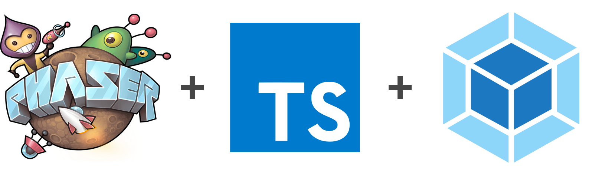

<h1 align="center">
  <br>
  <a href="https://github.com/yandeu/phaser-project-template#readme"></a>
  <br>
  WIP Rogue
  <br>
</h1>

<h4 align="center">
A starter template for <a href="https://phaser.io/" target="_blank" >Phaser 3</a> with <a href="https://www.typescriptlang.org/index.html" target="_blank" >TypeScript</a> and <a href="https://webpack.js.org/" target="_blank" >webpack</a> for building excellent html5-games that work great in the browser and on mobile devices.</h4>

<p align="center">
  <a href="https://opensource.org/licenses/MIT" title="License: MIT" >
    
  </a>
  
  
  <a href="https://github.com/prettier/prettier" alt="code style: prettier"></a>
</p>

## How To Use

You'll need [Git](https://git-scm.com) and [Node.js](https://nodejs.org/en/download/) (which comes with [npm](http://npmjs.com)) installed on your computer. From your command line:

```bash
# Ensure you are on the right node vcersion
$ nvm use

# Install dependencies
$ npm install

# Start the local development server (on port 8080)
$ npm start

# Ready for production?
# Build the production ready code to the /dist folder
$ npm run build

# Play your production ready game in the browser
$ npm run serve
```

All your game code lies inside the **/src/scripts** folder. All assets need to be inside the **/src/assets** folder in order to get copied to /dist while creating the production build.

## Custom Configurations

### TypeScript Compiler

Change the TypeScript compiler's settings in the tsconfig.json file.

If you are new to TypeScript, you maybe want to set **"noImplicitAny"** to **false**.

You'll find more information about the TypeScript compiler [here](https://www.typescriptlang.org/docs/handbook/compiler-options.html).

### Typings

You can put your custom type definitions inside typings/**custom.d.ts**.

### Webpack

All webpack configs are in the **webpack** folder.

### Obfuscation

_Obfuscation is disabled by default._

We are using the [webpack-obfuscator](https://github.com/javascript-obfuscator/webpack-obfuscator). Change its settings in webpack/webpack.prod.js if needed. All available options are listed [here](https://github.com/javascript-obfuscator/javascript-obfuscator#javascript-obfuscator-options).

## Useful Links

- [Phaser Website](https://phaser.io/)
- [Phaser 3 Forum](https://phaser.discourse.group/)
- [Phaser 3 API Docs](https://photonstorm.github.io/phaser3-docs/)
- [Official Phaser 3 Examples](http://labs.phaser.io/)
- [Notes of Phaser 3](https://rexrainbow.github.io/phaser3-rex-notes/docs/site/index.html)

## Credits

A huge thank you to Rich [@photonstorm](https://github.com/photonstorm) for creating Phaser

Thanks to [Yannick Deubel](https://github.com/yandeu). Please have a look at the [LICENSE](LICENSE) for more details.
